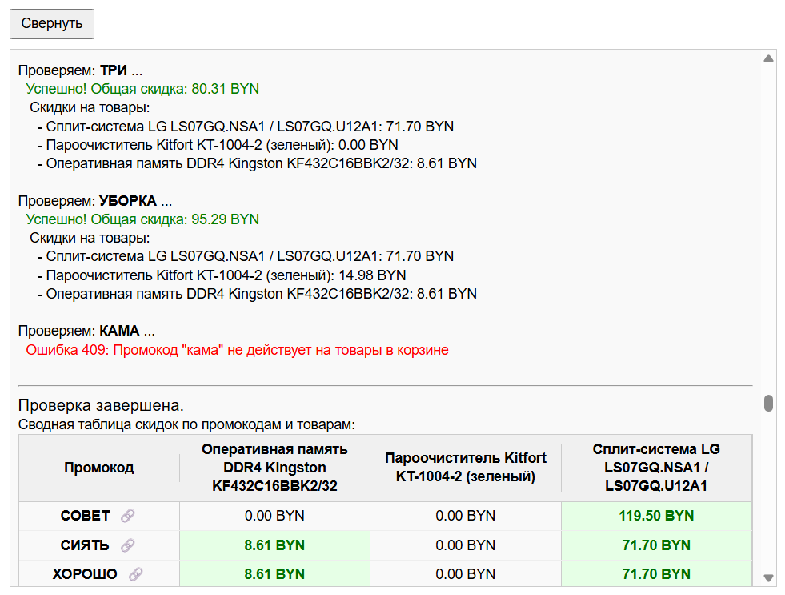

🧾 Автоматическая проверка промокодов

Скрипт автоматически перебирает промокоды и показывает, какие из них действительно работают — по каждому товару в вашей корзине.

💡 Что делает скрипт:
🔍 Проверяет все доступные промокоды
📦 Применяет их к каждому товару в корзине
📊 Отображает результат в наглядной таблице

📋 В таблице вы увидите:
🔠 Активный промокод

📦 К какому товару он применён

💰 Размер скидки

✅ Статус — применим или нет

🏷️ Зачем это нужно:
Скрипт экономит время и деньги перед оформлением заказа. Вы моментально видите, какой промокод даёт реальную выгоду и на что его стоит применить.

  

## 1. Установка плагина Tampermonkey

Для работы скрипта необходимо установить расширение Tampermonkey — менеджер пользовательских скриптов. Выберите версию под ваш браузер:

- **Google Chrome**  
  [Установить Tampermonkey из Chrome Web Store](https://chromewebstore.google.com/detail/tampermonkey/dhdgffkkebhmkfjojejmpbldmpobfkfo)

- **Microsoft Edge**  
  [Установить Tampermonkey из Microsoft Edge Addons](https://microsoftedge.microsoft.com/addons/detail/iikmkjmpaadaobahmlepeloendndfphd)

- **Safari (iOS)**  
  [Установить Tampermonkey из App Store](https://apps.apple.com/app/tampermonkey/id6738342400)

- **Opera**  
  [Установить Tampermonkey Beta из Opera Addons](https://addons.opera.com/en/extensions/details/tampermonkey-beta/)

- **Mozilla Firefox**  
  [Установить Tampermonkey из Firefox Add-ons](https://addons.mozilla.org/en-US/firefox/addon/tampermonkey/)

После установки активируйте расширение и перейдите к следующему шагу — установке скрипта.

## 2. Установка скрипта

После установки Tampermonkey необходимо добавить сам скрипт в менеджер.

1. Перейдите по ссылке на скрипт:  
   [https://raw.githubusercontent.com/dzmitry-masko/promocode-checker/main/promocode-checker.user.js](https://raw.githubusercontent.com/dzmitry-masko/promocode-checker/main/promocode-checker.user.js)

2. Tampermonkey автоматически предложит установить скрипт — нажмите кнопку **«Установить»**.

3. После установки скрипт начнёт работать на поддерживаемых сайтах, автоматически проверяя промокоды в вашей корзине.

---

Теперь вы готовы к использованию скрипта и экономии времени и денег!

## Поддержка

Если у вас есть вопросы или нужна помощь, присоединяйтесь к нашему Telegram-каналу поддержки:

[https://t.me/promocode_checker](https://t.me/promocode_checker)
